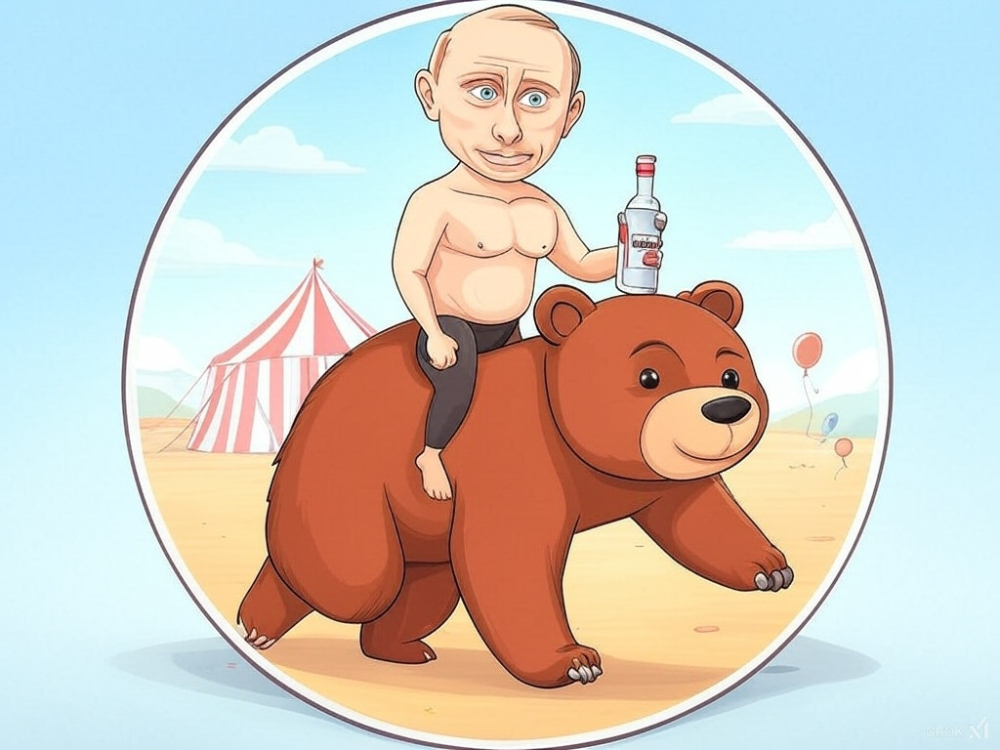
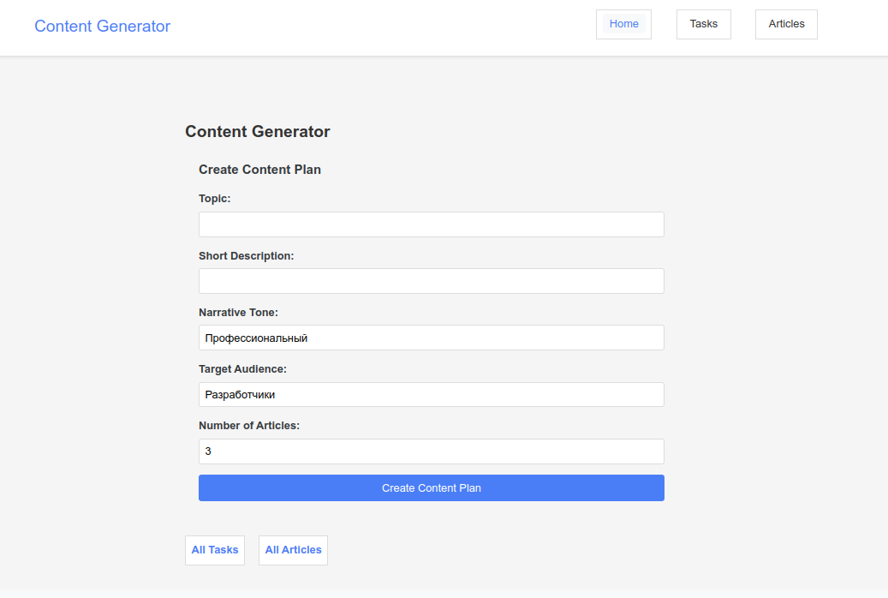
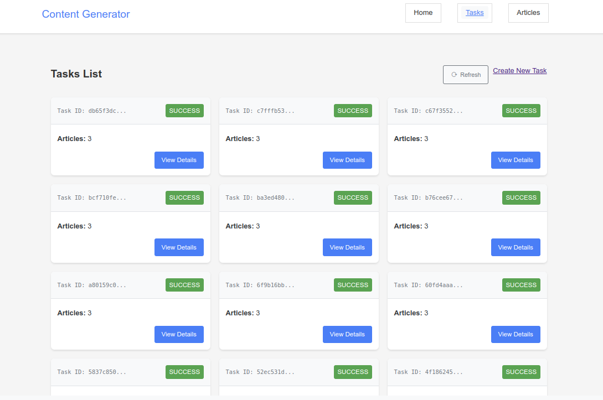
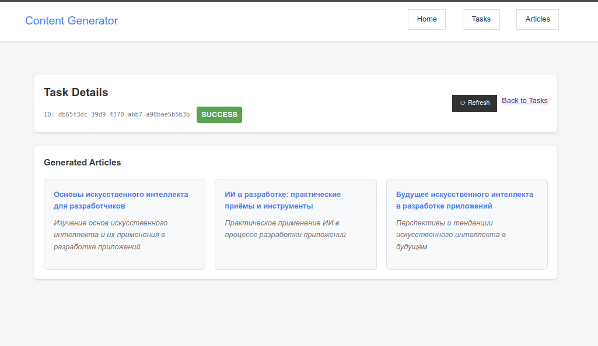
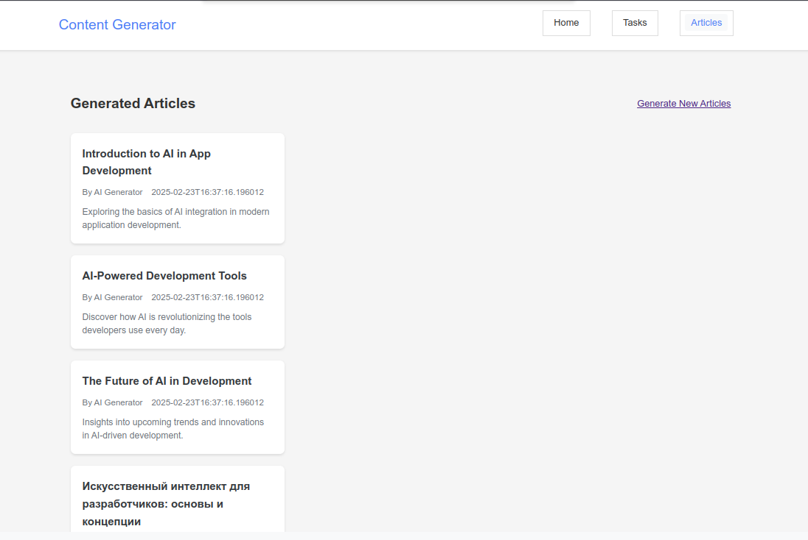
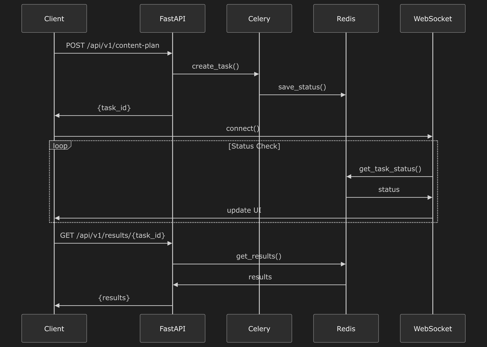

# Experimetal Project - Content Generator Project



## Описание проекта
Это образовательный проект предназначен для генерации контент-планов и статей, а также для переписывания и обновления существующих статей с использованием Celery для асинхронных задач.

## Требования
- Docker
- Docker Compose
- Poetry

## Быстрый старт
0. Скопируйте .env.example в .env и заполните необходимые переменные окружения.

1. Клонируйте репозиторий:
   ```bash
   git clone <repository_url>
   cd content_generator
   ```

2. Соберите Docker контейнеры:
   ```bash
   make build
   ```

3. Запустите все сервисы:
   ```bash
   make up
   ```

4. Проверьте логи для Celery:
   ```bash
   make celery-logs
   ```

## Структура проекта
- `docker/` - файлы для Docker и Docker Compose
- `src/` - исходный код проекта
  - `api/` - API endpoints
  - `core/` - основная логика проекта
  - `enums/` - перечисления
  - `schemas/` - схемы данных
  - `static/` - статические файлы (CSS, JavaScript)
  - `templates/` - шаблоны HTML
  - `tests/` - тесты
  - `utils/` - вспомогательные функции
- `utils/` - скрипты и утилиты
- `Makefile` - команды для управления проектом
- `README.md` - документация проекта

## API/Использование
### Генерация контент-плана
Используйте задачу `generate_content_plan_task` для генерации контент-плана.

### Генерация статьи
Используйте задачу `generate_article_task` для генерации отдельной статьи.

### Последовательная генерация статей
Используйте задачу `generate_articles_sequentially_task` для последовательной генерации статей.

### Переписывание статьи
Используйте задачу `rewrite_article_task` для переписывания статьи.

### Обновление статьи
Используйте задачу `generate_update_articles_task` для обновления статьи с разными командами.

## Примеры использования
Примеры использования задач можно найти в файлах `pipeline.py` и `rewrite.py`.

## Разработка
Для запуска тестов используйте команду:
```bash
make test
```

Для проверки кода используйте команду:
```bash
make lint
```
## Скриншоты

### Главная страница


### Страница задач


### Детали задачи


### Страница статей


### Диаграмма последовательности

